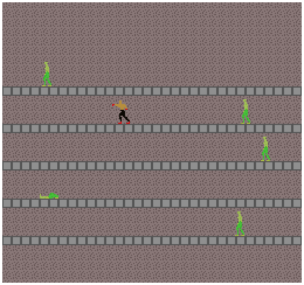

# Punchformer

Author: Siddharth Sahay (ssahay2)

Design: Punchformer is platforming + punching enemies, along with a "realistically animated" 3D-to-2D art style stuffed on top of the PPU. Your objective is to jump up to each level and punch the AI player on that level before it punches you. The AI gets faster with each level. The full game idea included actual platforms and powerups, but I didn't have time to implement them.

Screen Shot:

How Your Asset Pipeline Works:
* The player character is 3D modelled, rigged, and animated in Blender 2.91. Using Blender's Eevee render engine (don't need raytracing) with 64 samples (so it doesn't miss anything) and a film size of 0 (removes antialiasing) along with emission shaders (removes shadows and depth) on the model and side orthographic view (removes projection errors) lets Blender render restricted(ish) palette 2D images. The "animation" is 26 frames in a very low FPS (single frames sometimes) style because each frame is rendered at 16x24, hence 6 tiles, which eats into the 256 tile memory (156 tiles used for this in total). `run.py` scripts running Blender if needed, the `assets/punchformer.blend` file has all the settings baked in so pressing "Render Animation" should work as well.
* The 16x24 PNG frames are read in by the `dist/bundle` program and clustered into a 4 colour palette because Blender renders out the colors ever so slightly different (13 unique colors in the output instead of 4, probably compression?).
* Each 16x24 frame is written into 6 tiles in a local copy of the tile table in `dist/bundle`.
* Additionally, a 16x8 PNG `assets/background.png` made in GIMP is read in as 2 tiles in position 156 and 157, along with its color palette.
* The tile table, background palette, clustered palette, and a modified (more blue and alpha) palette for the AI are written to disk as binary files `assets/tile.dat` and `assets/palette.dat`.
* The game reads the binary files and copies them more or less directly to the PPU.
* This pipeline was tested on Windows with Blender in the PATH. With it, adding new frames, editing poses, and/or changing colors is trivial.

How To Play:
Space to jump, A and D to move left and right, V to punch. Once you jump up a level you can't jump down. The game doesn't really have an ending programmed in (lack of time), so you'll have to quit manually.

Sources: none.

This game was built with [NEST](NEST.md).

